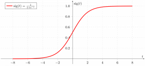

# Logistic Regression

## Overview
Logistic Regression is a **supervised machine learning algorithm** used for **binary classification problems**, Unlike **linear regression** which predicts continuous values it predicts the probability that an input belongs to a specific class. It is used for **binary classification** where the output can be one of two possible categories such as **Yes/No, True/False or 0/1**. It uses sigmoid function to convert inputs into a probability value between 0 and 1. In this article, we will see the basics of logistic regression and its core concepts.

## Types of Logistic Regression
It can be classified into three main types based on the nature of the dependent vaiables:
    - Binomial Logistic Regression
    - Multinomial Logistic Regression
    - Ordinal Logistic Regression

The **sigmoid function** is defined as:

\[
\sigma(z) = \frac{1}{1 + e^{-z}}
\]

Where:
- \(z = w_1x_1 + w_2x_2 + ... + w_nx_n + b\)
- \(w_i\) are weights, \(x_i\) are input features, and \(b\) is the bias.

The output of the sigmoid function is between 0 and 1. A threshold (usually 0.5) is applied to classify the output into classes.

## References:
- Greeksforgeeks.org